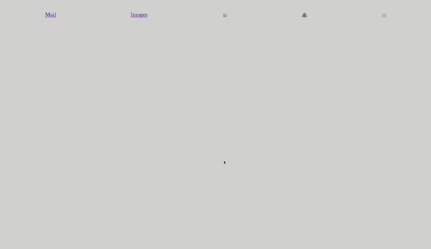

# HTML-CSS-Popup

# HTML і CSS практика: Hooli-style Popup

> **Hooli** є фіктивною корпорацією від
> [Silicon Valley TV series](https://www.imdb.com/title/tt2575988/).
> Багато хто вважає, що він імітує Google або Apple.
> Hooli на [Silicon Valley fandom wiki](https://silicon-valley.fandom.com/wiki/Hooli).
> Це також представлено [on the web](http://www.hooli.xyz/).

Мета цього завдання — потренуватися в кодуванні HTML і CSS з макета. Очікується, що ви поглибите свої знання HTML і CSS і відкриєте нові невідомі раніше функції.

## Вимоги

- ніякого JavaScript, лише HTML/CSS, дозволено використання препроцесорів
- ніяких зовнішніх бібліотек чи фреймворків
- підтримка веббраузера: лише Chrome (використовуйте найновіші фічі)
- очікується, що попап матиме три стани залежно від дій користувача:
  - початковий стан: попап не видно
  - після натискання на кнопку 'popup-button'
    попап стає видимим або прихованим, якщо воно вже відкрите
  - натисніть кнопку "More", щоб додати ще від 3 до 10 іконок і
    робить вміст попапу доступним для скролу
